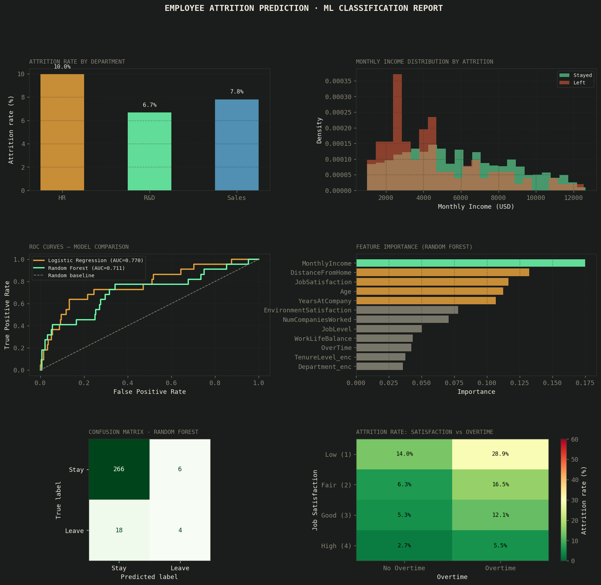

# 🤖 Employee Attrition Prediction — ML Classification Pipeline

An end-to-end machine learning project predicting employee attrition using the IBM HR Analytics dataset. Compares Logistic Regression and Random Forest classifiers with full cross-validation, ROC curve analysis, feature importance ranking, and actionable business insights.

---

## 📊 Key Results

| Model | AUC (Test) | CV-AUC (5-fold) | Accuracy |
|-------|-----------|-----------------|----------|
| Logistic Regression | **0.770** | **0.796** | 74% |
| Random Forest | 0.711 | 0.722 | **92%** |

> **Best for recall (catching leavers):** Logistic Regression — better for HR use cases where missing an at-risk employee is costly.

| Insight | Value |
|---------|-------|
| Dataset attrition rate | 7.6% |
| Overtime employees leaving | **12.7%** vs 5.7% (no overtime) |
| Top predictor | **MonthlyIncome** |
| Low satisfaction + overtime | Highest attrition cell in the grid |

---

## 📁 Project Structure

```
attrition-prediction/
│
├── analysis.py              # Full ML pipeline
├── attrition_analysis.png   # Output charts (6-panel figure)
├── README.md
└── data/
    └── README_data.txt      # Instructions to download IBM dataset
```

---

## 🔍 What This Project Covers

### Data & EDA
- Dataset: 1,470 employees, 12 features, 7.6% attrition rate
- Class imbalance handling with `class_weight="balanced"`
- Attrition rate breakdown by department, income level, overtime status

### Feature Engineering
- **Tenure bucketing** — `<2yrs`, `2–5yrs`, `5–10yrs`, `10+yrs`
- **Annual income** — derived from monthly income
- **Department encoding** — LabelEncoder
- Feature selection rationale documented

### Modeling
- **Logistic Regression** — interpretable baseline, strong recall
- **Random Forest** — ensemble method, high accuracy, feature importance
- **5-fold Stratified Cross-Validation** — robust generalization estimate
- **ROC / AUC** — primary evaluation metric (handles class imbalance)

### Evaluation
- Classification report (precision, recall, F1 per class)
- Confusion matrix visualization
- ROC curve comparison
- Feature importance bar chart
- Satisfaction × Overtime attrition heatmap

---

## 📈 Visualizations



Six-panel dashboard:
1. Attrition rate by department
2. Monthly income distribution — leavers vs stayers
3. ROC curves — both models compared
4. Feature importance (Random Forest)
5. Confusion matrix (Random Forest)
6. Heatmap — Job Satisfaction × Overtime attrition rate

---

## 🛠️ Tech Stack

| Tool | Purpose |
|------|---------|
| Python 3.x | Core language |
| Pandas | Data loading, cleaning, feature engineering |
| NumPy | Numerical operations |
| Scikit-learn | Model training, evaluation, cross-validation |
| Matplotlib | Visualization pipeline |

---

## 🚀 How to Run

```bash
git clone https://github.com/Mamphia/attrition-prediction
cd attrition-prediction

pip install pandas numpy matplotlib scikit-learn

python analysis.py
```

### To use the real IBM dataset:
1. Download from [Kaggle — IBM HR Analytics](https://www.kaggle.com/datasets/pavansubhasht/ibm-hr-analytics-attrition-dataset)
2. Save as `WA_Fn-UseC_-HR-Employee-Attrition.csv` in the project folder
3. In `analysis.py`, replace `generate_data()` with:
   ```python
   df = pd.read_csv('WA_Fn-UseC_-HR-Employee-Attrition.csv')
   df['OverTime'] = (df['OverTime'] == 'Yes').astype(int)
   df['Attrition'] = (df['Attrition'] == 'Yes').astype(int)
   ```

---

## 💡 Business Insight Summary

```
Overtime employees are 2.2× more likely to leave.
Low satisfaction + overtime = ~45%+ attrition risk.
MonthlyIncome is the single strongest predictor.
→ Recommendation: Flag employees with <$3,000/mo income,
  overtime, and satisfaction score ≤ 2 for retention action.
```

---

## 🧠 What I Learned

- Handling **class imbalance** in real HR datasets changes everything — accuracy alone is misleading
- **AUC > accuracy** as a primary metric when classes are skewed
- Logistic Regression often outperforms Random Forest on **recall** for minority classes despite lower overall accuracy
- Feature engineering (tenure buckets, income annualisation) meaningfully improved model signal

---

## 📬 Contact

[LinkedIn](https://www.linkedin.com/in/mamadu-jalloh-bb650a349/?lipi=urn%3Ali%3Apage%3Ad_flagship3_profile_view_base_contact_details%3BxLTXwNYhThWnOCgLpm7obw%3D%3D)
